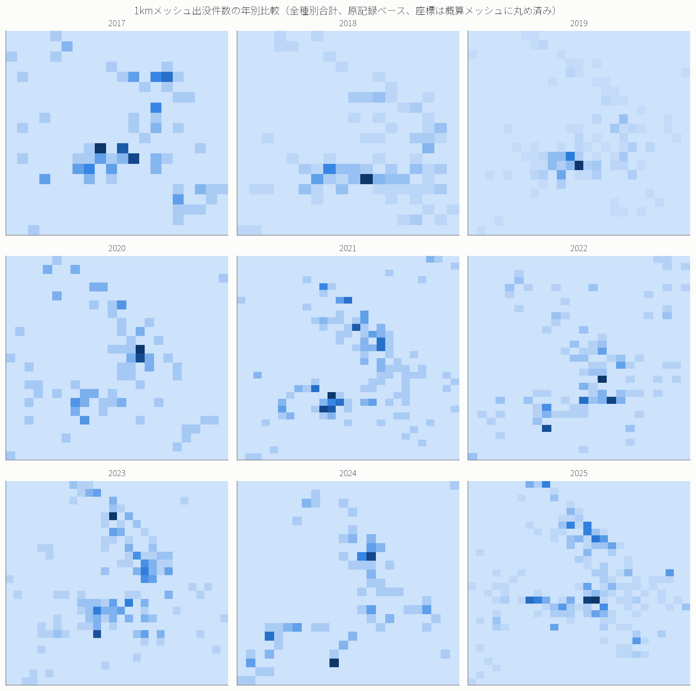
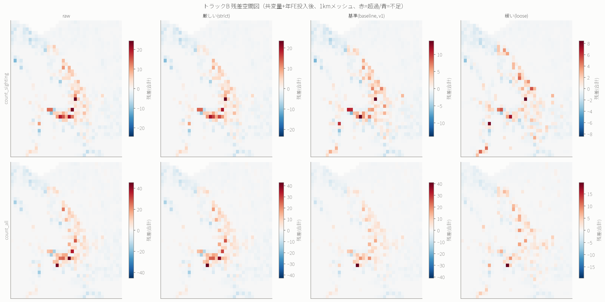
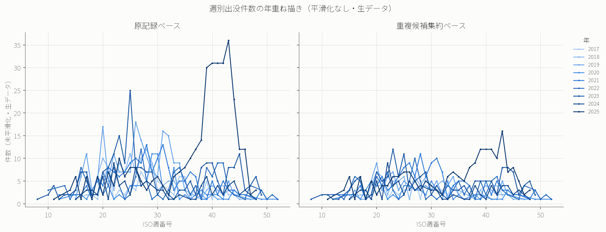
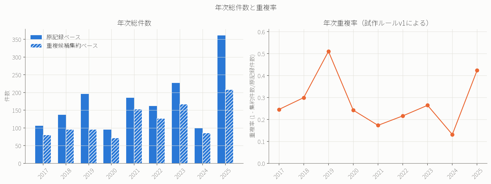

# higuma — 北海道ヒグマ出没情報の時空間分析

> **北海道のヒグマ地図を作る前に、その地図に混ざった人間の視線を測る。**

## 研究結果サマリー

札幌市の2017〜2025年のヒグマ出没記録1,568件を分析した結果、人口・道路・宅地・地形などの共変量を加えることで
空間分布の説明力は大きく改善しました。一方、それらを考慮した後も残差空間自己相関が残りました。ただし、この
残差をヒグマの実際の分布そのものとは解釈できません。

### 仮説判定

| 仮説 | 結果 | 補足 |
|---|---|---|
| H1 人間活動変数（人口・道路等）との対応 | **支持** | 疑似R²が約0.01→約0.21に改善。ただし「発見されやすさ」と「ヒグマの人里接近」の混合効果 |
| H2 共変量投入後も空間構造が残る | **支持** | 残差のMoran's Iが8条件すべてで有意（p=0.001）。生態的構造と断定はしない |
| H3 食物資源不作と秋季出没 | **判定不能** | 独立年数n=6（2020-2025）、leave-one-year-outで結果が不安定 |
| H4 春秋二峰性 | **部分的支持** | 季節集中は明確だが、毎年一律の二峰性ではない |
| H5 融雪と春ピーク | **判定不能** | n=9、融雪日の定義・重複処理次第で相関の符号・強さが変わる |
| H6 曜日周期 | **不支持** | 素朴な曜日差(約14%)は月・年を統制するとほぼ全条件で消失 |

詳細は [FINDINGS.md](FINDINGS.md) を参照。

### 主要な発見

- 人口・道路・土地利用・地形などの共変量投入で、出没分布の疑似決定係数が約0.01から約0.20〜0.24へ改善した。
- 共変量投入後も、統計的に有意な残差空間自己相関（Moran's I = 0.17〜0.33）が一貫して残った。
- 年間の季節パターンは、季節集中自体は明確だが、毎年一律の春秋二峰性ではなく、年によって単峰・複数山・
  不明瞭が混在する。
- 素朴な曜日差（最大約14%）は、月・年による季節性・年次変動を統制すると、ほぼ全ての種別・重複判定条件で
  統計的に有意でなくなった。
- 秋季食物資源の豊凶（H3）・融雪日と春季ピーク（H5）は、いずれも独立標本年数の不足（n=6, n=9）により
  判定不能とした。

### 主要図

**素朴な出没分布**（1kmメッシュ、年別）：

**共変量投入後の残差空間図**（赤=予測より超過、青=予測より不足）：

**季節性**（週別件数、年重ね描き・未平滑化）：

**原記録と重複候補集約の比較**（総件数・重複率）：

---

## プロジェクト概要

北海道ヒグマの出没情報から、ヒグマの相対的な出没・空間利用パターンと人間側の観測・通報努力をどこまで分離できるか、
分離した上で秋季食物資源の豊凶・気象と対応づけられるかを検証するプロジェクト。

詳細な研究計画・フェーズ定義は [PROJECT_SPEC.md](PROJECT_SPEC.md) を参照。再現手順は [FINDINGS.md](FINDINGS.md) 第9節を参照。

## フェーズ

- [x] P0: 先行研究サーベイ → [SURVEY.md](SURVEY.md)（判定: GO）
- [x] P1: データ取得可能性の確認 → [DATA_SOURCES.md](DATA_SOURCES.md)（判定: 継続可）
- [x] P2: データ取得・パネル構築（札幌市のみ） → [P2_GATE.md](P2_GATE.md)（P2d判定: 札幌市高解像度／全道低解像度を別系列化、全道統合は保留）
- [x] P3: 記述統計・観測過程診断（札幌市のみ） → [P3_DESCRIPTIVE.md](P3_DESCRIPTIVE.md)
- [x] P4a: 共変量取得・断層診断・分析仕様固定 → [reports/P4A_SUMMARY.md](reports/P4A_SUMMARY.md) / [P4_MODEL_PLAN.md](P4_MODEL_PLAN.md)
- [x] P4b: ベースラインモデル・残差診断 → [P4_RESULTS.md](P4_RESULTS.md)
- [x] P5: 食物資源・気象との突合 → [P5_RESULTS.md](P5_RESULTS.md)
- [x] P6: 最終レポート → [FINDINGS.md](FINDINGS.md)
